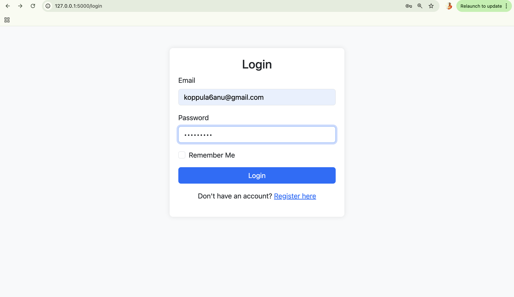
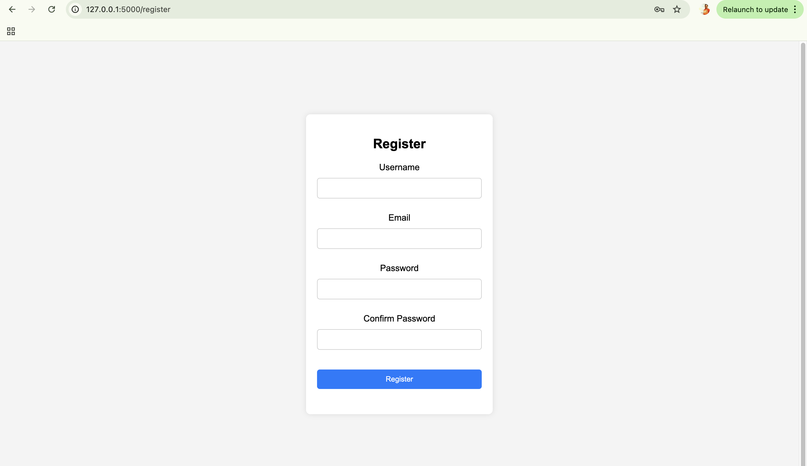

# Employee-Tracker-app
# Employee Tracker App

## Description
The Employee Tracker App is a web-based application designed to help organizations manage their employee data. It provides features to view, add, update, and delete employee records efficiently.

## Purpose
This app allows HR teams and managers to:
- Track employee details such as name, role, department, and contact information.
- Manage employee records through an easy-to-use interface.

## Value
- **Efficiency**: Streamlines HR operations by centralizing employee information.
- **Security**: User authentication ensures that employee data is protected.
- **User Experience**: Simple and responsive interface built with Flask and Bootstrap.

## Technologies Used
- **Backend**: Python (Flask)
- **Frontend**: HTML, CSS, JavaScript
- **Database**: SQLite with SQLAlchemy ORM
- **Authentication**: Flask-Login
- **UI Framework**: Bootstrap

## Screenshots
### Login Page


### Sign Up Page


## Installation
To run this project locally, follow these steps:

1. Clone the repository:
   ```bash
   git clone https://github.com/yourusername/Employee-Tracker-app.git
